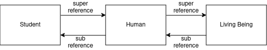
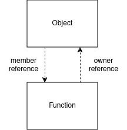

# Tscript Object Model

The *Tscript Virtual Machine* treats everything as an object.
This includes primitives, Types, custom class objects, Threads, Modules,
etc.<p>
Even if the tscript runtime specifications does not specify
the actual object model, it assumes a specific requirements.


## Objects as Lists

The Tscript Virtual Machine assumes that any object has a reference
to its direct super type members. Such a container of direct super
members we call 'super instance' while the object which holds the reference
to it is called 'sub instance'. As the name suggests each super instance is indeed
an object which itself holds reference to <b>its</b> direct super instance.
For that reason an object can be a super instance and a sub instance at the same time.
To support loading abstract functions of a sub instance from its super instance
each super instance must hold a reference to its sub instance.<p>
A concrete object might look like this:



Any object (sub instances and super instanced) should
hold a reference to its type object.

The object creation process can be described with the following function:

```javascript
function newObject(Type) {
    var node = Node(Type);
    node.subInstance = null;
    node.superInstance = null;
    
    if Type.superType != null then {
        var superNode = newObject(Type.superType) # recursive build
        node.superInstance = superNode;
        superNode.subInstance = node;
    }
    
    return node;
}
```


## Object Methods

In Tscript everything is an object, and so are functions. This allows
it to handle functions in code with variables, parameters in function calls
like any other object. But what if a function is bound to an object? What if 
we call such a function without accessing its owner?
To make this possible we make sure that every function has a reference to its
owner. By this a bound function (called method) has full control over its
owners members as expected.




## Module Objects

Unlike most other objects module objects are created and held by the virtual machine.
To be more precise modules are loaded and held by the ModuleLoader.<p>
A module holds all module related elements. This for example includes
the Constant Pool, the Function Area and the Type Area (see runtime specifications).
Since global variables and definitions are also module related they are also
stored as members a module object. These members can then be accessed via imports
from other Modules like common object member accesses.
