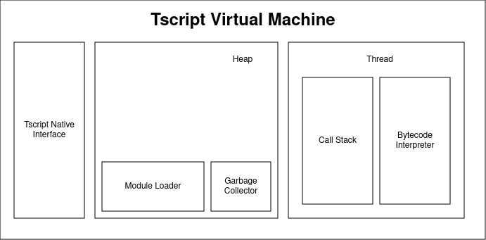
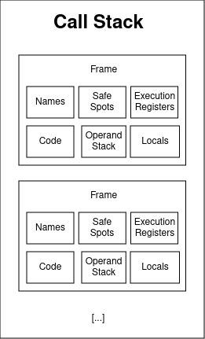
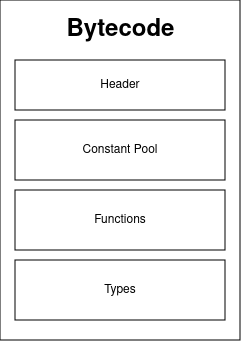

# Tscript Runtime Specifications

The Tscript execution engine is a stack based Virtual Machine (bytecode interpreter)
and is called the *Tscript Virtual Machine*.
In this section its structure is discussed.

## The Overall Structure

The Tscript Virtual Machine is divided into multiple sections:

Like Java, Tscript supports multithreading by design. This means
that different parts of a program can be executed in parallel.
A `Thread` itself is responsible for managing its own function call stace
via the `Call Stack` and executing the bytecode via the `Bytecode Interpreter`.
There can run multiple threads at a time in the VM.

All computed data is stored in the heap section. This includes class objects,
but also primitive objects, since everything is an object in this VM implementation.
Since Tscript has automatic memory management, it also requires a `Garbage Collector`
for doing so. For this java implementation the underlying jvm-gc is used.
However, the actual garbage collection algorithm is not specified.

In order to load and import modules the `Module Loader` is required. 
It loads all module information at runtime if required. Each module itself
is an object and is held by the Module Loader on the Heap.

When executing native functions, functions implemented in another language (mostly
the underlying VM language, here java) the `Tscript Native Interface` (TNI) can be used 
to so. It is responsible for loading native implementations as a Tscript
Function Object to the caller. Functions which are non-native are called 'virtual'.
Virtual functions can also be executed from the native side.

## Call Stack

The call stack has the following structure:

A Call Stack consists of multiple `Frames`. Each frame hold information
about a single function call in the stack trace. This information include:
- <b>Code:</b> the bytecode for this function
- <b>Locals:</b> stores all local variables for a single function call by index
- <b>Operand Stack:</b> stores all currently computed values, as defined in the bytecode.
- <b>Safe Spots:</b> a stack of all instruction addressed to which to jump if an error is thrown,
for example in case of a try-catch statement.
- <b>Names:</b> A map of all names that are used. This map is empty first and might grow over time.
- <b>Execution Registers: </b> holds additional information like:
  - The instruction pointer, pointing to the next executed bytecode instruction
  - the stack pointer, pointing to the top of the operand stack
  - the owner of this function, if existing
  - the module in which this function is defined
  - the current line in the programs sourcecode

Frames are also created for native functions for recreating proper error logs, if printing
the call trace. Of course some frame elements might be absent in that case.

## Error Handling Procedure

In case of a thrown error the virtual machine performs a backtracking mechanism,
which pops frames of the stack until it has found a top frame which safe spot stack is not empty.
In that case it pops this address from it, pushes the current error message onto the top
frame and proceeds in that frame at the popped safe spot address.
If the call stack gets empty while popping frames the error is logged to the standard error
and the thread terminates.
Note that <b>any</b> error can be caught.

## Module Structure

All Modules are object, treated as every other object. However, modules are
created by the Virtual Machine itself and can not be instantiated the common way
(their class is abstract).

Modules consist of multiple parts:
- Constant Pool: Holding constants and names defined in this module only.
- Function Area: Holding Functions meta information for this module only,
from which new virtual Function Objects can be created.
- Type Area: Holding virtual Types with their static initializer functions
for this module only, from which they can be loaded. However, Types are singletons
and never copied, cloned or anything else. When a new Type is loaded which has not been
initialized, its initializer block is called first.

## Bytecode

The bytecode of a module describes it's structure:

