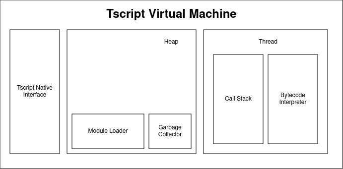
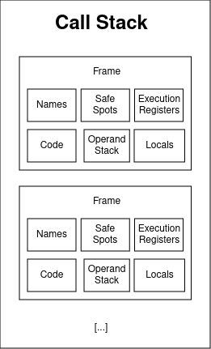
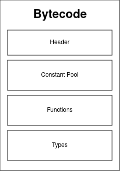

# Tscript Runtime Specifications

The Tscript execution engine is a stack based Virtual Machine (bytecode interpreter)
and is called the *Tscript Virtual Machine*.
In this section its structure is discussed.

## The Overall Structure

The Tscript Virtual Machine is divided into multiple sections:

Like Java, Tscript supports multithreading by design. This means
that different parts of a program can be executed in parallel.
A `Thread` itself is responsible for managing its own function call stace
via the `Call Stack` and executing the bytecode via the `Bytecode Interpreter`.
There can run multiple threads at a time in the VM.

All computed data is stored in the heap section. This includes class objects,
but also primitive objects, since everything is an object in this VM implementation.
Since Tscript has automatic memory management, it also requires a `Garbage Collector`
for doing so. For this java implementation the underlying jvm-gc is used.
However, the actual garbage collection algorithm is not specified.

In order to load and import modules the `Module Loader` is required. 
It loads all module information at runtime if required. Each module itself
is an object and is held by the Module Loader on the Heap.

When executing native functions, functions implemented in another language (mostly
the underlying VM language, here java) the `Tscript Native Interface` (TNI) can be used 
to so. It is responsible for loading native implementations as a Tscript
Function Object to the caller. Functions which are non-native are called 'virtual'.
Virtual functions can also be executed from the native side.

## Call Stack

The call stack has the following structure:

A Call Stack consists of multiple `Frames`. Each frame hold information
about a single function call in the stack trace. This information include:
- <b>Code:</b> the bytecode for this function
- <b>Locals:</b> stores all local variables for a single function call by index
- <b>Operand Stack:</b> stores all currently computed values, as defined in the bytecode.
- <b>Safe Spots:</b> a stack of all instruction addressed to which to jump if an error is thrown,
for example in case of a try-catch statement.
- <b>Names:</b> A map of all names that are used. This map is empty first and might grow over time.
- <b>Execution Registers: </b> holds additional information like:
  - The instruction pointer, pointing to the next executed bytecode instruction
  - the stack pointer, pointing to the top of the operand stack
  - the owner of this function, if existing
  - the module in which this function is defined
  - the current line in the programs sourcecode

Frames are also created for native functions for recreating proper error logs, if printing
the call trace. Of course some frame elements might be absent in that case.

## Error Handling Procedure

In case of a thrown error the virtual machine performs a backtracking mechanism,
which pops frames of the stack until it has found a top frame which safe spot stack is not empty.
In that case it pops this address from it, pushes the current error message onto the top
frame and proceeds in that frame at the popped safe spot address.
If the call stack gets empty while popping frames the error is logged to the standard error
and the thread terminates.
Note that <b>any</b> error can be caught.

## Module Structure

All Modules are object, treated as every other object. However, modules are
created by the Virtual Machine itself and can not be instantiated the common way
(their class is abstract).

Modules consist of multiple parts:
- Constant Pool: Holding constants and names defined in this module only.
- Function Area: Holding Functions meta information for this module only,
from which new virtual Function Objects can be created.
- Type Area: Holding virtual Types with their static initializer functions
for this module only, from which they can be loaded. However, Types are singletons
and never copied, cloned or anything else. When a new Type is loaded which has not been
initialized, its initializer block is called first.

## Bytecode

The bytecode of a module describes it's structure:

### Header
A compiled files begins with the following header:
- <b>Magic number:</b> the number `0xDEAD` in 2 bytes indicating
  that this may be a valid file containing tscript byte code
- <b>module name:</b> the name of this module (canonical module path with dot-notation)
- <b>Minor version:</b> the minor version this bytecode supports (1 byte)
- <b>Major version:</b> the major version this bytecode supports (1 byte)
- <b>Entry point:</b> a 2 byte function id for the first function to execute (main function)
- <b>Global variables:</b> a list of names for the global registers, that are important
  for external accesses. Each name is followed by one byte determining weather this register is
  mutable or not. If mutable the byte is 1. The amount of names is determined by a leading 2 byte number.

### Constant Pool
The Constant Pool holds arbitrary constants and information that are
accessed at runtime. 
The purpose of the constant pool is to simplify and speed up the
instruction execution process, especially fetching the required data.
The constant pool begins with a 4 byte number encoding the amount of
entries in the pool.
Entries are structured as follows:
 
<b>ID | TYPE | VALUE</b> 
where: 
- <b>ID:</b> is a 2 byte size number, indexing the entry
- <b>TYPE:</b> the type of the following value
- <b>VALUE:</b> the actual value/constant being stored

The constant pool supports the following types:
- INTEGER (4 bytes)
- REAL (8 bytes)
- STRING (n bytes + null-terminator)
- BOOL (1 byte)
- NULL (0 byte)
- RANGE (2 * 2 bytes referencing to integer values in the constant-pool)
- ARRAY (n * 2 bytes referencing to any entry in the constant pool + 1 byte array length representing n)
- DICTIONARY (n * 2 * 2 bytes for key and value, each referencing any entry
  in the constant pool + 1 byte dictionary length regarding the entries representing n)
- UTF8 (n bytes + null-terminator)

### Functions
The functions section begins with a 2 byte number encoding the amount
of functions. 
Each functions head is encoded as follows: 
<b>INDEX | NAME | PARAM_LIST | STACK_SIZE | LOCAL_REGISTER_AMOUNT | INSTRUCTION_AMOUNT</b>
 
where: 
- <b>INDEX:</b> is the unique 2 byte ID associated with this function. Allows faster lookup for loading a new instance.
  The index is stored in the constant pool for the VFUNCTION entry.
- <b>NAME:</b> is the name of the function ending with a null-terminator
- <b>PARAM_LIST:</b> a list of parameters. Each parameter is encoded by starting with its name,
  the end is determined with a null-terminator, and its 2 byte default-value-address,
  referencing to a constant in the constant pool. If a parameter has no default value its index-byte is -1.
  The amount of parameters is determined with a leading byte.
- <b>STACK_SIZE:</b> a 2 byte number indicating the size of this functions stack
- <b>LOCAL_REGISTER_AMOUNT:</b> a 2 byte number indicating the amount of local
  registers for this function (used for local variables)
- <b>INSTRUCTION_AMOUNT:</b> a 4 byte integer encoding the amount of instructions in this function

After the header all its instructions are encoded sequentially.

#### Instructions
Instructions are structured as follows: 
<b>OPCODE | ARGS</b> 
where: 
- <b>OPCODE:</b> is a 1 byte number indicating the operation to perform
- <b>ARGS:</b> some optional additional bytes. The amount of the additional bytes depends
  on the OPCODE.

For more information about the actual instructions see tscript_bytecode_instructions.md.

### Types
The Type section begins with a 2 byte number encoding the amount
of types. 
Each type is encoded as follows: 
<b>INDEX | NAME | SUPER_TYPE_INDEX | IS_ABSTRACT | CONSTRUCTOR_INDEX | STATIC_BLOCK_INDEX |STATIC_MEMBERS </b>
 
where: 
- <b>INDEX:</b> is the unique 2 byte ID associated with this type. Allows faster lookup for loading.
  This ID is in bounds of: 0 <= ID < amount-of-types, for example the first type might be indexed by 0,
  the second by 1 and so on.
  The index is stored in the constant pool for the TYPE entry
- <b>NAME:</b> is the name of the type ending with a null-terminator
- <b>SUPER_TYPE_INDEX:</b> a 2 byte ID referencing a function-entry in the constant pool.
  Is -1 1 if this class has no super type
- <b>IS_ABSTRACT:</b> a single byte being 1 if this type is abstract
- <b>CONSTRUCTOR_INDEX:</b> a 2 byte index referencing a function that will be called as the constructor.
  Is -1 if no constructor is provided
- <b>CONSTRUCTOR_VISIBILITY:</b> a single byte encoding the visibility (see Type Members)
- <b>STATIC_BLOCK_INDEX:</b> a 2 byte index referencing a function that will be called as the static member initializer.
  Returns -1 if no static block is provided
- <b>STATIC_MEMBERS:</b> a 2 byte number encoding the amount of type bound members, followed by a sequence of
  their actual encoding
- <b>INSTANCE_MEMBER:</b> a 2 byte number encoding the amount of instance bound members for this type,
  followed by a sequence of their actual encoding

#### Type Members
Type members are structured as follows: 
<b>NAME | SPECS</b>
 
where: 
- <b>NAME:</b> is the name of this member with a null-terminator
- <b>SPECS:</b> a 1 byte integer encoding specific properties for this member.

These are: 
Visibility: (Note: if no of the following applies the default visibility is <b>public</b>)
- <b>public:</b> lsb is 1
- <b>protected:</b> second bit after lsb is 1
- <b>private:</b> third bit after lsb is 1

Mutability: 
If the forth bit after lsb is 1 then this member is immutable for external accesses (see opcode `STORE_EXTERNAL`),
else mutable.

The other bits are currently not in use. By default, every member is assigned to the null-value.

