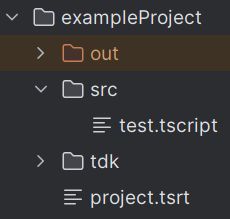

# How to setup a Tscript-Project

In this section is shown how you can set up a new tscript project.
An example project can be found in `exampleProject`.

### The project structure

It is recommended to structure your project as follows:

 

- <b>exampleProject:</b> The overall project directory. Every
file concerning the project should be stored here.
- <b>project.tsrt:</b> This Project file defines the overall
configuration for execution and dependency loading.
- <b>src:</b> the source folder for the actual script files
to execute. Here the main script is the `test.tscript` file.
- <b>tdk:</b> the <b>Tscript development kit</b> defines a set
of common used code snippets. This includes features like threading,
math namespaces, canvas- and turtle namespaces, networking namespaces, etc.
- <b>out:</b> This directory is optional and may be generated on execution
automatically. In this directory all compiled files are stored for execution
process.

### The Project File

The Project File defines the execution configuration. It specifies source locations,
fragment location (the location of compiled files), etc.

Note that the <b>required</b> importance
states out that the command is only important for direct execution. When imported the file is still valid,
even without these missing commands.

| Command    | Argument                                               | Importance | Description                                                                                                                                             |
|------------|:-------------------------------------------------------|:-----------|:--------------------------------------------------------------------------------------------------------------------------------------------------------|
| src        | source directory                                       | required   | Defines the directory with the actual source code.                                                                                                      |
| out        | output directory                                       | required   | Defines the directory where compiled files are stored for execution.                                                                                    |
| run        | boot module                                            | required   | Defines the module being executed on program start.                                                                                                     |
| inspection | inspection directory                                   | optional   | Defines the directory where inspection files are stored. Inspection files contains bytecode in human readable format. It might be useful for debugging. |
| root       | additional root directory                              | optional   | Defines an additional root path. A root path defines a directory where the Virtual Machine looks up imported modules.                                   |
| package    | included project file path                             | optional   | Defines a path to an included project for source code and native definitions. The tdk must be included explicitly.                                      |
| native     | fully qualified name of native function implementation | optional   | Registers the implementation of a native function. <b>There cannot be multiple native functions with the same name, even across inclusions!</b>         |
